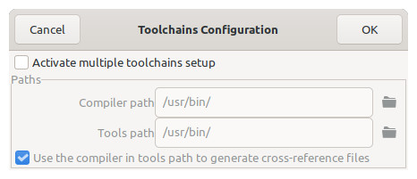
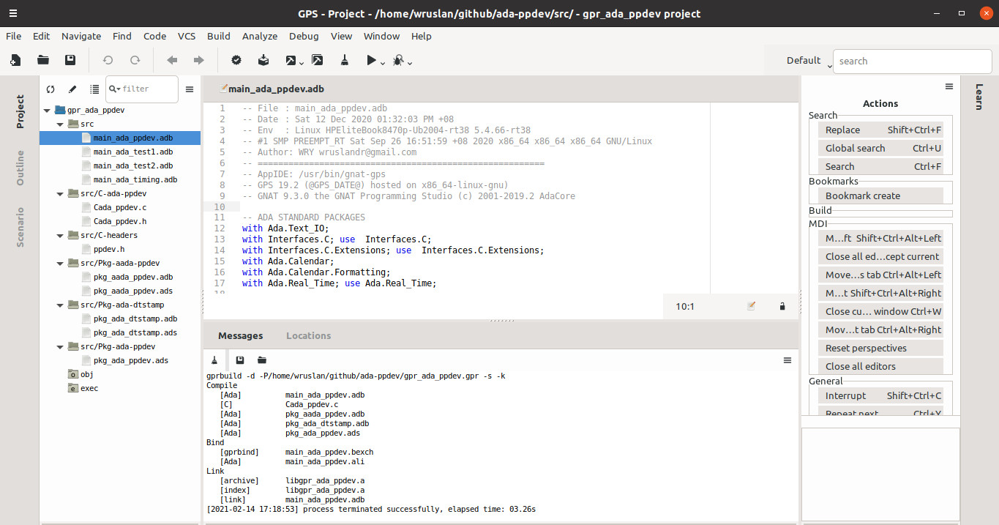
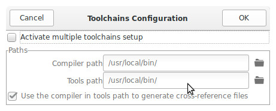
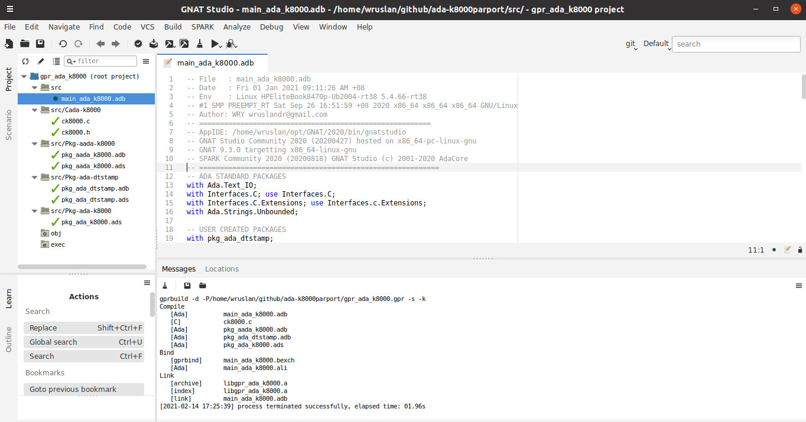

# ada2012 IDE

Ada-2012 GNAT-GPS Studio IDE versus GNAT-Studio-Community + SPARK IDE

-- AppIDE: /usr/bin/gnat-gps 
-- GPS 19.2 (@GPS_DATE@) hosted on x86_64-linux-gnu) 
-- GNAT 9.3.0 the GNAT Programming Studio (c) 2001-2019.2 AdaCore

-- AppIDE: /home/wruslan/opt/GNAT/2020/bin/gnatstudio 
-- GNAT Studio Community 2020 (20200427) hosted on x86_64-pc-linux-gnu 
-- GNAT 9.3.0 targetting x86_64-linux-gnu 
-- SPARK Community 2020 (20200818)  
-- GNAT Studio (c) 2001-2020 AdaCore

Wassalam.
WRY

